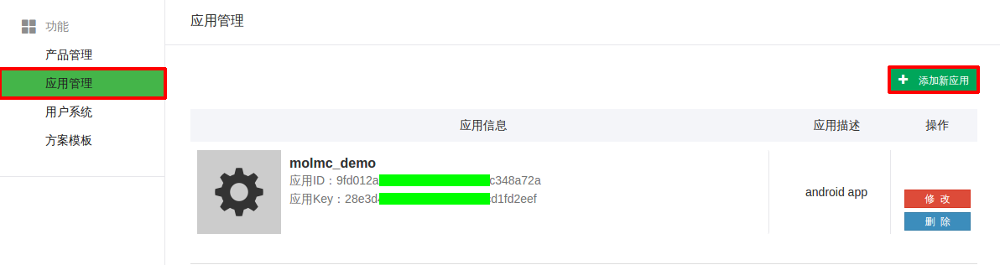
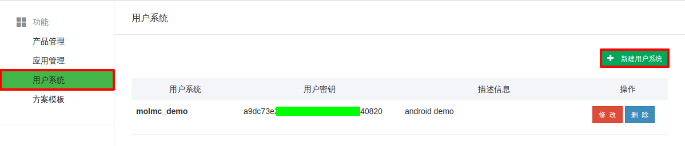
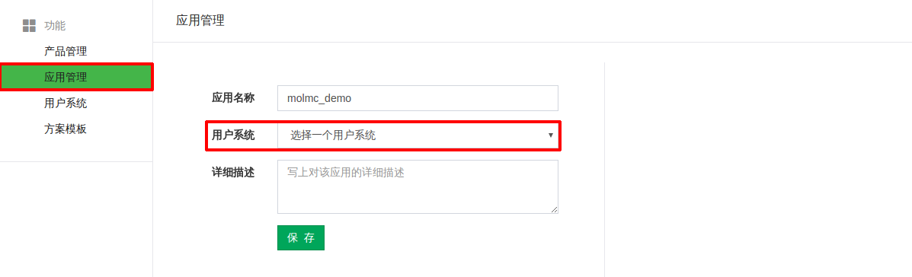

# AndroidSDK-Demo
This is a demo which used Android SDK library.

#Android 开发指南

##1、概述
IntoRobot接入方案概况
* IntoRobot设备接入SDK（以下简称SDK）封装了手机与IntoRobot硬件设备的通讯协议，以及手机与IntoRobot云平台的通讯协议。这些协议包括配置入网，连接，设备状态监听，心跳等。使用SDK使得开发者能够快速完成App开发，开发者可以更加专注于界面的开发，提升App的用户体验。

SDK功能模块
* HTTP请求
* MQTT连接
* ImLink设备配置


##2、开发准备
开发环境
* [Android Studio](http://www.android-studio.org/)

注册IntoRobot开发者帐号
* 在使用IntoRobot服务之前，你需要注册[IntoRobot](http://www.intorobot.com/)帐号或在[IntoRobot开放平台](https://api.intorobot.com)上注册开发者帐号，IntoRobot帐号可直接登录开放平台。

获取App ID
* 登录开放平台后，在应用管理界面添加应用，创建一个App应用，生成一对`App ID`和`App Key`。

下载SDK Demo源码
* [AndroidSDK-Demo](https://github.com/IntoRobot/AndroidSDK-Demo)

导入SDK
* 在项目工程application的build.gradle文件中添加依赖
```Groovy
dependencies {
    compile 'com.molmc.intorobot:opensdk:0.3.0'
}
```

##3、SDK流程简介
* SDK集成流程图<br/>


* 配置AndroidManifest.xml<br/>
【添加权限】
将下面权限配置代码复制到AndroidManifest.xml文件中
``` xml
	<uses-permission android:name="android.permission.CHANGE_WIFI_STATE"/>
	<uses-permission android:name="android.permission.INTERNET"/>
	<uses-permission android:name="android.permission.ACCESS_NETWORK_STATE"/>
	<uses-permission android:name="android.permission.ACCESS_WIFI_STATE"/>
	<uses-permission android:name="android.permission.READ_EXTERNAL_STORAGE"/>
	<uses-permission android:name="android.permission.WRITE_EXTERNAL_STORAGE"/>
    <uses-permission android:name="android.permission.WAKE_LOCK" />
    ...
    <service android:name="com.molmc.opensdk.mqtt.service.MqttService"/>
```
【权限说明】<br/>
| 权限 						| 用途    					 |
|----------------------------|------------------------------|-
|  CHANGE_WIFI_STATE    	 |  允许程序改变WiFi连接状态		  |
|  INTERNET			    	 |  允许程序打开网络接口			  |
|  ACCESS_NETWORK_STATE   	 |  允许程序访问有关GSM网络信息 	 |
|  ACCESS_WIFI_STATE	   	 |  允许程序访问WiFI网络状态信息 	 |
|  READ_EXTERNAL_STORAGE   	 |  允许程序读取外部SD卡 	       |
|  WRITE_EXTERNAL_STORAGE  	 |  允许程序写入外部SD卡 	       |
|  WAKE_LOCK			  	 |  允许程序保持唤醒 		        |
* 添加SDK依赖库
将下面都代码复制到工程Application的build.gradle文件中
```Groovy
dependencies {
    compile 'com.molmc.intorobot:opensdk:0.3.0'
}
```
* 初始化SDK
使用SDK之前，需要先初始化SDK。初始化需要用户指定SDK的App ID和App Key以及设置是否需要打印调试信息。
继承Application类，在Application子类的onCreate方法中添加。<br/>
**【方法调用】**
```java
//初始化SDK
IntoRobotAPI.getInstance().initApp(getApplicationContext(), appId, appKey);
//打印调试信息
IntoRobotAPI.getInstance().setDebug(true);
```
其中 **appId** 即在开发平台上创建应用时生成的App ID，**appKey**为appId对应的密钥；
其中 **setDebug**方法设置是否打印调试信息，默认为false，不打印调试信息。<br/>
**【代码示例】**
``` java
import com.molmc.opensdk.openapi.IntoRobotAPI;
private String appId = "e8554799f7xxxxxxxxxx7b7e97817258";
private String appKey = "1c7caab5ebfe5xxxxxxxx963067327cb";
...
@Override
public void onCreate() {
    super.onCreate();
    //初始化SDK
    IntoRobotAPI.getInstance().initApp(getApplicationContext(), appId, appKey);
    //打印调试信息
    IntoRobotAPI.getInstance().setDebug(true);
}
```
* 回调说明
1、Http 请求回调
```java
public interface HttpCallback<T> {
	/**
	 * 成功的回调对象
	 *
	 * @param code
	 * @param result
	 */
	void onSuccess(int code, T result);

	/**
	 * 失败的回调
	 *
	 * @param exception
	 */
	void onFail(TaskException exception);
}
```
2、Mqtt subscribe（订阅消息）回调
```java
public interface SubscribeListener {

	/**
	 * subscribe 成功回调
	 * @param topic
	 */
	void onSuccess(String topic);

	/**
	 * subscribe 失败回调
	 * @param topic
	 */
	void onFailed(String topic, String errMsg);
}
```
3、Mqtt subscribe 接收数据回调
```java
public interface ReceiveListener {

	/**
	 * 接收到订阅的消息
	 * @param topic
	 * @param message
	 */
	void onReceive(String topic, MqttMessage message);
}
```
4、Mqtt publish（发布消息）回调
```java
public interface PublishListener {

	/**
	 * 发布消息成功
	 * @param topic
	 */
	void onSuccess(String topic);

	/**
	 * 发布消息失败
	 * @param topic
	 * @param errMsg
	 */
	void onFailed(String topic, String errMsg);
}
```

* 集成注意事项
	1、 SDK已经封装了所有的用户、配置、连接、控制的过程，开发者使用这些API可以完成上述流程中的功能开发，不需要再自行实现协议。

    2、 SDK接口采用异步处理方式，每个接口采用回调方式将数据传给用户，用户自行处理数据

    3、SDK 用户token失效，需用调用自行处理刷新token

    4、SDK控制设备采用Mqtt协议，相关资料请参阅[Mqtt网站](http://mqtt.org/)

##4、开发接口
###4.1、用户部分
* 创建用户系统
用户系统包括用户注册、登录、修改密码、修改个人信息等功能。IntoRobot平台以App ID来区分用户系统，不同的App ID的用户系统相互独立。用户系统在[开放平台](https://api.intorobot.com)上设置。


* 绑定用户系统
创建应用（App）时要求绑定一个用户系统。


* 获取App token
App token用于控制App的访问频率，避免恶意访问。App的其他操作也需要App token有效才能操作。用户启动App访问登录、注册等接口前，需获取App Token。App Token有过期时间，有效期为24小时，过期后需要重新获取访问该接口获取新的App token。
【示例代码】
```java
IntoRobotAPI.getInstance().requestAppToken(new HttpCallback<AppTokenBean>() {
    @Override
    public void onSuccess(int code, AppTokenBean result) {
	//TODO 获取成功
    }

    @Override
    public void onFail(TaskException exception) {
	//TODO 获取失败
    }
});
```

* 用户注册
IntoRobot平台提供手机注册和邮箱注册两种方式。
1、手机注册
第一步：App获取手机短信验证码，SDK向IntoRobot云平台发送获取短信验证码请求，若请求成功则手机会收到短信验证码。
【示例代码】
```java
UserBeanReq userBean = new UserBeanReq();
userBean.setZone("0086");
userBean.setPhone("185****4563");
userBean.setType(SdkConstant.HTTP_REQUEST_VLDCODE_PHONE);
IntoRobotAPI.getInstance().requestVerifyCode(userBean, new HttpCallback() {
    @Override
    public void onSuccess(int code, Object result) {
        // TODO 请求成功
    }

    @Override
    public void onFail(TaskException exception) {
        // TODO 请求失败
    }
});
```
第二步：收到短信验证码后，App将手机短信验证码、手机号码、密码、用户名等信息传给SDK，即可在IntoRobot云平台上注册用户帐号。
【示例代码】
```java
UserBeanReq userTokenBeanReq = new UserBeanReq();
userTokenBeanReq.setUsername(userName);	//用户名
userTokenBeanReq.setZone("0086");	//区号默认中国0086
userTokenBeanReq.setPhone(account);	//手机号码
userTokenBeanReq.setPassword(password);	//密码
userTokenBeanReq.setVldCode(vldCode);	//手机短信验证码
IntoRobotAPI.getInstance().registerAccount(userTokenBeanReq, new HttpCallback<UserTokenBean>() {
    @Override
    public void onSuccess(int code, UserTokenBean result) {
        // TODO 注册成功
    }

    @Override
    public void onFail(TaskException exception) {
        // TODO 注册失败
    }
});
```
2、邮箱注册
第一步： App获取邮箱验证码，ADK向IntoRobot云平台发送获取邮箱验证码请求，若请求成功则邮箱会收到验证码。
【示例代码】
```java
UserBeanReq userBean = new UserBeanReq();
userBean.setEmail(account);
userBean.setType(SdkConstant.HTTP_REQUEST_VLDCODE_EMAIL);
IntoRobotAPI.getInstance().requestVerifyCode(userBean, new HttpCallback() {
    @Override
    public void onSuccess(int code, Object result) {
        // TODO 请求成功
    }

    @Override
    public void onFail(TaskException exception) {
        // TODO 请求失败
    }
});
```
第二步：收到邮箱验证码后，App将邮箱验证码、邮箱地址、密码、用户名等信息传给SDK，即可在IntoRobot云平台上注册用户帐号。
【示例代码】
```java
UserBeanReq userTokenBeanReq = new UserBeanReq();
userTokenBeanReq.setUsername(userName);	//用户名
userTokenBeanReq.setEmail(account);		//邮箱地址
userTokenBeanReq.setPassword(password);	//密码
userTokenBeanReq.setVldCode(vldCode);	//邮箱验证码
IntoRobotAPI.getInstance().registerAccount(userTokenBeanReq, new HttpCallback<UserTokenBean>() {
    @Override
    public void onSuccess(int code, UserTokenBean result) {
        // TODO 注册成功
    }

    @Override
    public void onFail(TaskException exception) {
        // TODO 注册失败
    }
});
```

* 用户登录
用户用只能注册过的手机号码、邮箱登录，若App ID更换，则用户系统改变，登录帐号失效，需要重新注册。
【示例代码】
```java
UserBeanReq userBean = new UserBeanReq();
if (IntoUtil.isEmail(account)) {
    userBean.setEmail(account);		//邮箱用户
}else{
    userBean.setZone("0086");
    userBean.setPhone(account);		//手机用户
}
userBean.setPassword(password);		//登录密码
IntoRobotAPI.getInstance().userLogin(userBean, new HttpCallback<UserTokenBean>() {
    @Override
    public void onSuccess(int code, UserTokenBean result) {
        // TODO 登录成功处理
    }

    @Override
    public void onFail(TaskException exception) {
        // TODO 登录失败处理
    }
});
```
* 重置密码
用户忘记密码时，可用重置密码接口找回密码。忘记密码需调用获取验证码接口，向服务器发送获取手机验证码或邮箱验证码请求，App得到验证码后发送重置密码接口。
【示例代码】
```java
UserBeanReq userBean = new UserBeanReq();
if (IntoUtil.isEmail(account)) {
    userBean.setEmail(account);		//如果发送的是邮箱验证码，则是使用邮箱地址
}else{
    userBean.setZone("0086");		//手机区号
    userBean.setPhone(account);		//如果发送的是手机验证码，则是使用手机号码
}
userBean.setPassword(password);		//新密码
userBean.setVldCode(vldCode);		//手机或邮箱验证码
IntoRobotAPI.getInstance().resetUserPassword(userBean, new HttpCallback() {
    @Override
    public void onSuccess(int code, Object result) {
        // TODO 重置成功
    }

    @Override
    public void onFail(TaskException exception) {
        // TODO 重置失败
    }
});
```
###4.2、设备部分
* 创建产品
设备是产品的实例化，产品是在[IntoRobot开放平台](https://api.intorobot.com)上创建的。创建产品及产品化请参考[《IntoRobot产品化》](http://)。

* 配置并创建设备
产品化后，才能创建可控制都设备。通过手机App创建的设备可以在手机等终端进行控制。App创建设备分为两个步骤：
第一步通过ImLink配置设备连接网络，第二步通过Sdk在IntoRobot云平台创建设备。配置设备需要提供输入设备名称和WiFi密码界面。

确保手机WiFi开启，获取手机当前连接的WiFi SSID和BSSID，
【示例代码】
```java
//获取手机连接的WiFi SSID和BSSID
mWifiUtils = new WifiUtils(getActivity());
mWifiUtils.getConnectedInfo();
currentConnectWifi = mWifiUtils.getConnectedSSID().replaceAll("\"", "");	//获取手机连接的WiFi的SSID
mWifiUtils.getConnectedBSSID()		//获取手机连接的WiFi的BSSID
```
输入设备名称和当前WiFi的密码开始配置设备并示例化`ImlinkConfig`类，设置监听回调`ImlinkListener`，调用配置方法`startConfig`。
【示例代码】
```java
//实例化ImlinkConfig类
imlinkConfig = new ImlinkConfig(getActivity());
//设置监听回调
imlinkConfig.setImlinkListener(new ImlinkListener() {
    @Override
    public void onSuccess() {
		//TODO 创建设备成功
    }

    @Override
    public void onProgress(int progress, String msg) {
		//TODO 配置进度
    }

    @Override
    public void onFailed(TaskException exception) {
		//TODO 创建设备失败
    }
});
//开始配置
imlinkConfig.startConfig(wifiSSid, mWifiUtils.getConnectedBSSID(), wifiPassword, deviceReq);
```
具体配置界面及参数获取可参考[AndroidSDK-Demo](https://github.com/IntoRobot/AndroidSDK-Demo)中的`ImlinkNetworkFragment`类进行配置设备。

* 获取设备列表
创建设备后，用户可在设备列表界面查看该帐号下创建的所有设备。
【示例代码】
```java
IntoRobotAPI.getInstance().getDeviceList(new HttpCallback<ArrayList<DeviceBean>>() {
    @Override
    public void onSuccess(int code, ArrayList<DeviceBean> result) {
		// TODO 获取设备列表成功
    }

    @Override
    public void onFail(TaskException exception) {
		// TODO 获取设备列表失败
    }
});
```
* 获取设备详细信息
获取设备详细信息，用于展示单个设备的具体界面，并且实现设备的控制和数据接收发送。
【示例代码】
```java
IntoRobotAPI.getInstance().getDeviceInfo(device.getDeviceId(), new HttpCallback<ProductBean>() {
    @Override
    public void onSuccess(int code, ProductBean result) {
        // TODO 获取设备详细信息成功
    }

    @Override
    public void onFail(TaskException exception) {
        // TODO 获取失败
    }
});
```
* 删除设备
【示例代码】
```java
IntoRobotAPI.getInstance().deleteDevice(device.getDeviceId(), new HttpCallback() {
    @Override
    public void onSuccess(int code, Object result) {
        // TODO 删除设备成功
    }

    @Override
    public void onFail(TaskException exception) {
        // TODO 删除设备失败
    }
});
```
* 监听设备在线状态
监听设备在线状态是实时推送。获取设备列表后，订阅（subscribe）设备的在线状态。该接口有另个回调方法，`SubscribeListener`为订阅是否成功的回调函数；`ReceiveListener`为接收数据回调，只有当订阅成功了，`ReceiveListener`才有效。设备有"**在线**"和"**离线**"两种状态：分别返回payload: "**online**"和"**offline**"。
【示例代码】
```java
IntoRobotAPI.getInstance().getDeviceOnlineStatus(device.getDeviceId(), new SubscribeListener() {
    @Override
    public void onSuccess(String topic) {
		//TODO 订阅设备在线状态成功
    }

    @Override
    public void onFailed(String topic, String errMsg) {
        //TODO 订阅设备在线状态失败
    }
}, new ReceiveListener() {
    @Override
    public void onReceive(String topic, MqttMessage message) {
	String payload = new String(message.getPayload());
		// TODO 监听到设备在线状态信息
    }
});
```
* 取消监听设备在线状态
由于IntoRobotAPI.getInstance()是全局单例，生命周期和App一样长，在每一个Activity或Fragment中订阅（Subscribe）消息，回调方法随着Activity或Fragment的destory而失效。订阅的消息并没有移除订阅列表，因此需要在`onDestroy`方法中取消订阅（unsubscribe）。
【示例代码】
```java
IntoRobotAPI.getInstance().unSubDeviceOnlineStatus(device.getDeviceId(), new UnSubscribeListener() {
    @Override
    public void onSuccess(String topic) {
		// TODO 取消监听成功
    }

    @Override
    public void onFailed(String topic, String errMsg) {
        // TODO 取消监听失败
    }
});
```
###4.3设备控制
* 创建Mqtt连接
在发布指令或接收消息之前，必须先创建[Mqtt](http://mqtt.org/)连接。建立Mqtt连接需要帐号和密码，其中帐号（mqttUser）是用户登录时IntoRobot平台返回的token，而密码则是返回的userId。
【示例代码】
```java
mqttUser = StorageUtil.getInstance().getMqttToken();	//	可直接调用token
mqttPwd = StorageUtil.getInstance().getUserId();	//	可直接调用userId
IntoRobotAPI.getInstance().createMqttConnection(mqttUser, mqttPwd, new ConnectCallback() {
    @Override
    public void onConnectSuccess() {
		// TODO 创建连接成功
    }

    @Override
    public void onConnectFailure() {
        // TODO 创建连接失败
    }
});
```

* 发布控制指令
【示例代码】
```java
String payload;
if (isChecked){
    payload = "1";
}else{
    payload = "0";
}
IntoRobotAPI.getInstance().publisTopic(deviceId, sensor, payload, new PublishListener() {
    @Override
    public void onSuccess(String topic) {
		// TODO 发布成功
    }

    @Override
    public void onFailed(String topic, String errMsg) {
        // TODO 发布失败
    }
});
```
* 接收数据
【示例代码】
```java
IntoRobotAPI.getInstance().subscribeTopic(deviceId, sensor, new SubscribeListener() {
    @Override
    public void onSuccess(String topic) {
		// TODO 订阅成功
    }

    @Override
    public void onFailed(String topic, String errMsg) {
        // TODO 订阅失败
    }
},  new ReceiveListener() {
    @Override
    public void onReceive(String topic, MqttMessage message) {
	String payload = new String(message.getPayload());
		// TODO 接收到数据
    }
});
```
* 取消订阅（不接收数据）
【示例代码】
```java
IntoRobotAPI.getInstance().unsubscribeTopic(deviceId, sensor, new UnSubscribeListener() {
    @Override
    public void onSuccess(String topic) {
		// TODO 取消订阅成功
    }

    @Override
    public void onFailed(String topic, String errMsg) {
        // TODO 取消订阅失败
    }
});
```

* 断开连接
【示例代码】
手动断开连接，将取消所有订阅消息，不在接收数据和发送指令。
```java
IntoRobotAPI.getInstance().disconnectMqtt();
```

##5、返回码说明
| 返回码                |   说明                | 返回码                |   说明                | 返回码                |   说明                | 返回码                |   说明                |
|-----------------------|:---------------------:|-----------------------|:---------------------:|-----------------------|:---------------------:|-----------------------|:---------------------:|-
|   50101               |   系统错误			|   40001               |   错误调用			    |   40114               |   激活码过期			    |   41210               |   设备需要解锁		    |
|   50102               |   系统错误			|   40002               |   参数错误			    |   40115               |   账户已被冻结	    	|   41211               |   设备需要解锁		    |
|   50103               |   系统错误			|   40003               |   不允许			    |   40116               |   请求sms vldCode太频繁  |   41212               |   数量限制			    |
|   50104               |   系统错误			|   40004               |   资源不存在			|   40117               |   注册太频繁			    |   41213               |   未知型号			    |
|   50105               |   系统错误			|   40005               |   数据错误			    |   40118               |   忘记密码太频繁		    |   41214               |   缺少phyDeviceId		|
|   50106               |   系统错误			|   40006               |   uid不匹配			    |   40152               |   需要重登陆			    |   1100                |   Imlink建立失败		    |
|   50201               |   系统错误			|   40007               |   device id不匹配		|   40154               |   需要刷新token		    |   1101                |   获取WiFi IP地址失败	|
|   50202               |   系统错误			|   40008               |   id不合法			    |   40153               |   缺少refreshToken	    |   1102                |   接收数据解析错误	    |
|   50203               |   系统错误			|   40009               |   缺少id			    |   40301               |   字段类型错误		    |   1103                |   UDP接收数据失败		|
|   50204               |   系统错误			|   40010               |   缺少vrfID			    |   40302               |   数量限制			    |   1104                |   socket连接错误		    |
|   50205               |   系统错误			|   40011               |   验证码错误			|   40303               |   用户系统被引用		    |   1105                |   发送数据，未知主机	    |
|   50206               |   系统错误			|   40012               |   content type错误	    |   40304               |   用户系统不存在		    |   1106                |   UDP发送数据失败		|
|   50207               |   系统错误			|   40013               |   size错误			    |   40401               |   没有权限			    |   1107                |   发送数据解析错误	    |
|   50208               |   系统错误			|   40014               |   间隔错误			    |   40402               |   数量限制			    |   1108                |   设备握手响应超时	    |
|   50209               |   系统错误			|   40015               |   缓存过期			    |   40403               |   App被引用			    |   1109                |   设备设置平台信息超时   |
|   50301               |   系统错误			|   40016               |   验证码过期			|   40404               |   App不存在			    |   1110                |   设备不可用			    |
|   50302               |   系统错误			|   40017               |   已经存在			    |   40405               |   没有appToken		    |   1111                |   创建设备超时		    |
|   50303               |   系统错误			|   40018               |   名称重复			    |   40406               |   token过期			    |   1200                |   创建设备成功		    |
|   50304               |   系统错误			|   40020               |   请重试			    |   40502               |   数量限制			    |   -100                |   网络错误               |
|   50305               |   系统错误			|   40021               |   请求太频繁			|   40503               |   字段类型错误		    |
|   50306               |   系统错误			|   40022               |   name不合法			|   40504               |   产品不存在			    |
|   50307               |   系统错误			|   40023               |   zone不合法			|   40505               |   已经在申请流程中  	    |
|   50308               |   系统错误			|   40024               |   sms数量限制			|   40506               |   不在申请流程中		    |
|   50309               |   系统错误			|   40025               |   签名错误			    |   40602               |   数量限制			    |
|   50310               |   系统错误			|   40026               |   Header错误			|   40603               |   字段类型错误		    |
|   50311               |   系统错误			|   40027               |   上传内容缺失		    |   40604               |   解决方案不存在		    |
|   50312               |   系统错误			|   40101               |   用户未注册			|   41001               |   appid不匹配			|
|   50313               |   系统错误			|   40102               |   用户未激活			|   41101               |   时间戳太旧			    |
|   50314               |   系统错误			|   40103               |   密码错误			    |   41102               |   Auth字段不正确		    |
|   50315               |   系统错误			|   40104               |   缺少stateID			|   41104               |   token不存在			|
|   50316               |   系统错误			|   40105               |   state码错误			|   41201               |   device坐标参数错误	    |
|   50317               |   系统错误			|   40106               |   openid已绑定		    |   41202               |   device纬度参数错误	    |
|   50318               |   系统错误			|   40107               |   帐号已绑定			|   41203               |   device经度参数错误	    |
|   50319               |   系统错误			|   40108               |   用户名已存在		    |   41204               |   设备id已注册		    |
|   50320               |   系统错误			|   40109               |   邮箱已注册			|   41205               |   设备id未注册		    |
|   50321               |   系统错误			|   40110               |   手机号已注册		    |   41206               |   设备id不合法		    |
|   50322               |   系统错误			|   40111               |   需要重登陆			|   41207               |   设备需要在线		    |
|   50323               |   系统错误			|   40112               |   用户名不合法		    |   41208               |   不是设备拥有者		    |
|   50324               |   系统错误			|   40113               |   已关注该用户		    |   41209               |   正在更新token		    |


